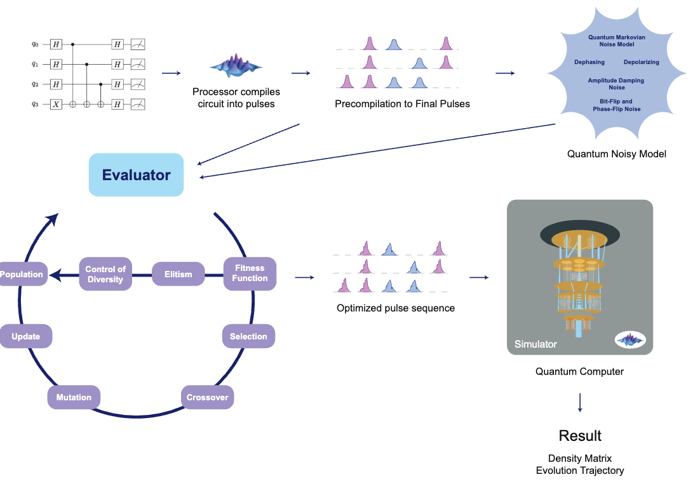

# Adaptive Genetic Algorithms for Pulse Level Quantum Error Mitigation

**A Genetic Algorithm proposal for Optimizing Deutsch-Jozsa and Grover Circuits Under Noise**

[](LICENSE)
[](https://www.python.org/downloads/release/python-312/)

---

## Table of Contents
1. [Overview](#overview)
2. [Features](#features)
3. [Project Structure](#project-structure)
4. [Installation](#installation)
5. [Usage](#usage)
   - [Command-Line Arguments](#command-line-arguments)
   - [Running the Project](#running-the-project)
   - [Viewing Results](#viewing-results)
6. [Algorithms and Noise Model](#algorithms-and-noise-model)
7. [Genetic Algorithm Details](#genetic-algorithm-details)
8. [Diversity Control](#diversity-control)
9. [Testing](#testing)
10. [Results and Figures](#results-and-figures)
11. [Workflow](#workflow)
12. [Example Output](#example-output)
13. [FAQ](#faq)
14. [Citation](#citation)
15. [Contributing](#contributing)
16. [License](#license)
17. [Contact](#contact)

---

## Overview
This project implements a **genetic algorithm** to optimize **Deutsch-Jozsa** and **Grover** quantum circuits at the pulse level under realistic noise conditions. The aim is to **maximize fidelity** of the final quantum state by tweaking gate parameters. This code was developed for research purposes and supports pulse-level error mitigation in noisy quantum environments.

Technologies:
- **[QuTiP](http://qutip.org/)** for quantum simulations.
- **[QuTiP-QIP](https://qutip-qip.readthedocs.io/en/latest/)** for quantum information processing and circuit modeling.
- **[DEAP](https://deap.readthedocs.io/en/master/)** for the genetic algorithm.
- **Python 3.12** for development.

---

## Features
- **Quantum Circuit Simulation**: Implements Deutsch-Jozsa and Grover algorithms.
- **Genetic Algorithm Optimization**: Optimizes quantum gate parameters to mitigate noise.
- **Noise Model**: Realistic noise models (T1, T2, bit-flip, and phase-flip).
- **Visualization**: Generates plots for pulse sequences, fidelities, and parameter correlations.
- **Reproducible Results**: Stores results in timestamped directories for detailed analysis.

---

## Project Structure

```plaintext
quantum_optimization/
├── circuits/                     # Quantum circuit definitions
│   ├── __init__.py
│   ├── quantum_circuit_base.py   # Abstract base class for quantum circuits
│   ├── deutsch_jozsa_circuit.py  # Deutsch-Jozsa circuit implementation
│   └── grover_circuit.py         # Grover circuit implementation
├── src/
│   ├── __init__.py
│   ├── evaluator.py              # Evaluation of genetic algorithm individuals
│   ├── genetic_optimizer.py      # Genetic algorithm implementation
│   ├── noise_model.py            # Noise models used in simulation
│   ├── quantum_utils.py          # Utility functions for quantum operations
│   └── visualizer.py             # Visualization of results and pulse sequences
├── tests/
│   ├── test_evaluator.py         # Unit tests for Evaluator class
│   ├── test_genetic_optimizer.py # Unit tests for GeneticOptimizer class
│   ├── test_noise_model.py       # Unit tests for NoiseModel class
│   ├── test_quantum_circuit.py   # Unit tests for QuantumCircuit class
│   └── test_visualizer.py        # Unit tests for Visualizer class
├── output_circuits/              # (Generated) Folder where output results are stored
│   └── [timestamped_subfolders]  # Logs, optimized pulses, plots, CSV files, etc.
├── .github/
│   └── workflows/
│       └── test.yml              # GitHub Actions workflow for continuous testing
├── requirements.txt              # Python dependencies
├── main.py                       # Main script to run the project
└── README.md                     # Project overview (this file)
```

---

## Installation

### Prerequisites
- Python 3.12 or later.
- Git installed on your machine.

### Steps
1. **Clone the repository**:
   ```bash
   git clone https://github.com/Universidad-Cenfotec/Pulse-Quantum-Error-Correction.git
   cd quantum_optimization
   ```

2. **Create and activate a virtual environment**:
   ```bash
   python3 -m venv venv
   source venv/bin/activate    # On Windows: venv\Scripts\activate
   ```

3. **Install dependencies**:
   ```bash
   pip install -r requirements.txt
   ```

---

## Usage

### Command-Line Arguments
| Argument        | Description                                    | Example                      |
|-----------------|------------------------------------------------|------------------------------|
| `--algorithm`   | Specify which circuit to run (`grover` or `deutsch-jozsa`). | `--algorithm grover`         |
| `--population_size`    | Set the population size for the genetic algorithm.   | `--population_size 50`              |
| `--generations` | Set the number of generations for optimization.      | `--generations 100`          |
| `--t1`          | T1 relaxation time constant (noise model).          | `--t1 50`                    |
| `--t2`          | T2 dephasing time constant (noise model).           | `--t2 30`                    |
| `--bit_flip_prob`    | Bit-flip error probability.                         | `--bit_flip_prob 0.02`            |
| `--phase_flip_prob`  | Phase-flip error probability.                       | `--phase_flip_prob 0.02`          |

### Running the Project
Run the project with default parameters:
```bash
python main.py --algorithm deutsch-jozsa
```
or
```bash
python main.py --algorithm grover
```

Advanced configuration example:
```bash
python main.py \
    --algorithm grover \
    --pop_size 100 \
    --generations 200 \
    --t1 50 \
    --t2 30 \
    --bit_flip 0.02 \ 
    --phase_flip 0.02
```

### Viewing Results
Results are stored in **`output_circuits/`**, organized by timestamped folders. Typical files include:
- **`fidelity_evolution.png`**: Fidelity over generations.
- **`pulses_optimized.png`**: Visualized optimized pulse shapes.
- **`results.csv`**: Numerical logs for analysis.
- **`correlation_matrix.png`**: Correlation matrix for optimized parameters.
- **`histogram_fidelities.png`**: Distribution of fidelity values over generations.
- **`histogram_parameters.png`**: Histograms for optimized gate parameters (e.g., CNOT, SNOT, X gates).
- **`parameter_evolution.png`**: Evolution of individual gate parameters over generations.
- **`fidelity_comparison.csv`**: Comparison of fidelities before and after optimization.
- **`summary_optimization.csv`**: Summary statistics for optimized runs.
- **`summary_no_optimization.csv`**: Summary statistics for runs without optimization.

---

## Algorithms and Noise Model

1. **Deutsch-Jozsa Algorithm**:
   - Determines if a given function \( f(x) \) is constant or balanced in a single query.

2. **Grover's Algorithm**:
   - Searches an unstructured database of \( N \) items in \( O(\sqrt{N}) \) queries.

### Noise Model
- **T1 Relaxation**: Simulates energy loss from qubits.
- **T2 Dephasing**: Models phase decoherence.
- **Bit-Flip & Phase-Flip**: Introduces random discrete errors.

---

## Genetic Algorithm Details
The genetic algorithm optimizes pulse parameters:
1. **Initialization**: Randomly generates an initial population.
2. **Evaluation**: Computes fidelity for each individual.
3. **Selection & Crossover**: Combines top-performing individuals.
4. **Mutation**: Applies small random changes.
5. **Elitism**: Retains best solutions across generations.
6. **Diversity Control**: To ensure the genetic algorithm maintains a diverse population and avoids premature convergence.

---

## Testing
Run unit tests to verify functionality:
```bash
python -m unittest discover -s tests
```

---

## Workflow
Below is a diagram summarizing the workflow of this project:



1. Initialize genetic algorithm with random population.
2. Simulate quantum circuit under noisy conditions.
3. Evaluate fidelity and fitness of each individual.
4. Perform selection, crossover, and mutation to generate a new population.
5. Repeat until desired fidelity is achieved or maximum generations reached.
6. Store results and generate visualizations.

---

Below are enhanced visualizations and results generated during the optimization process, offering insights into the performance of the genetic algorithm and the impact of noise mitigation:

1. **Fidelity Evolution Over Generations**\\
   This graph demonstrates how the fidelity improves over successive generations, showcasing the effectiveness of the genetic algorithm in optimizing gate parameters under noise conditions.\\

   /DeutschJozsa_4Q_2024-12-31_21-58-14/DeutschJozsa_4Q_With_Opt_fidelity_evolution.jpg)

2. **Optimized Pulse Sequence**\\
   Visual representation of the optimized pulse sequence for the Deutsch-Jozsa circuit after applying the genetic algorithm. Notice the distinct modulation patterns designed to counteract noise.\\

   /DeutschJozsa_4Q_2024-12-31_21-58-14/DeutschJozsa_4Q_With_Opt_optimized_pulses.jpg)

3. **Parameter Correlation Matrix**\\
   A heatmap illustrating the correlation between optimized parameters, providing insights into their interdependence and the genetic algorithm’s exploration of the parameter space.\\

   /DeutschJozsa_4Q_2024-12-31_21-58-14/DeutschJozsa_4Q_With_Opt_correlation_matrix.jpg)

4. **Distribution of Fidelity Values**\\
   Histogram showing the distribution of fidelity values across individuals in the population during the final generation, reflecting the diversity and robustness of the optimization.\\

   /DeutschJozsa_4Q_2024-12-31_21-58-14/DeutschJozsa_4Q_With_Opt_histogram_fidelities.jpg)

5. **Gate Parameter Evolution**\\
   A dynamic plot tracking the evolution of key gate parameters (e.g., CNOT, SNOT) across generations, highlighting how the genetic algorithm fine-tunes each parameter.\\

   /DeutschJozsa_4Q_2024-12-31_21-58-14/DeutschJozsa_4Q_With_Opt_parameter_evolution_CNOT.jpg)

These results collectively illustrate the power of pulse-level optimization in mitigating quantum noise, underscoring the potential of genetic algorithms in quantum computing research.

---

## FAQ
### How do I modify noise parameters?
Change T1, T2, and error probabilities in `noise_model.py` or pass them via command-line arguments.

### What hardware can run this?
Designed for Python 3.12, runs efficiently on any modern laptop with >8GB RAM.

---

## Citation
If you use this code for academic purposes, please cite:
```bibtex
```

---

## License
Distributed under the **MIT License**. See `LICENSE` for more details.

---

## Contact
William Aguilar-Calvo  
GitHub: [@thewill-i-am](https://github.com/thewill-i-am)  
Email: [wil-20-01@live.com](mailto:wil-20-01@live.com)

---
